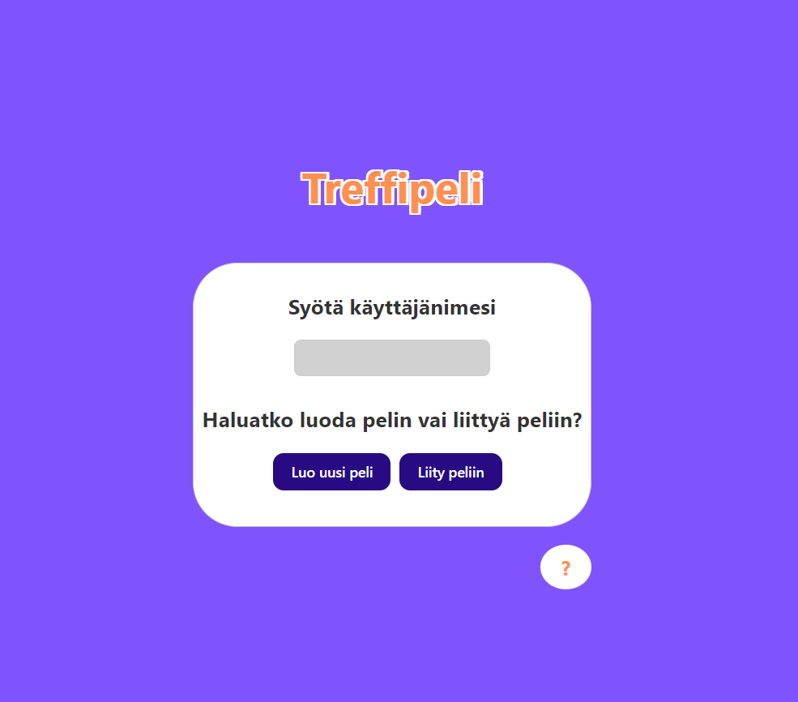
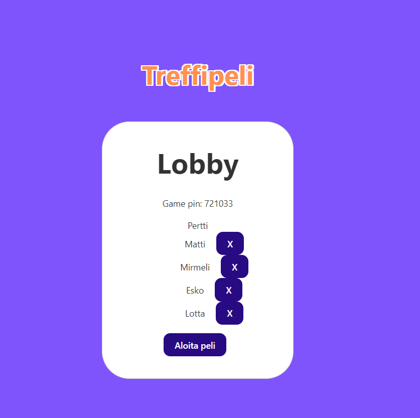
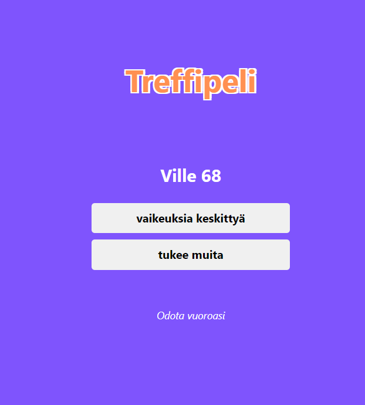
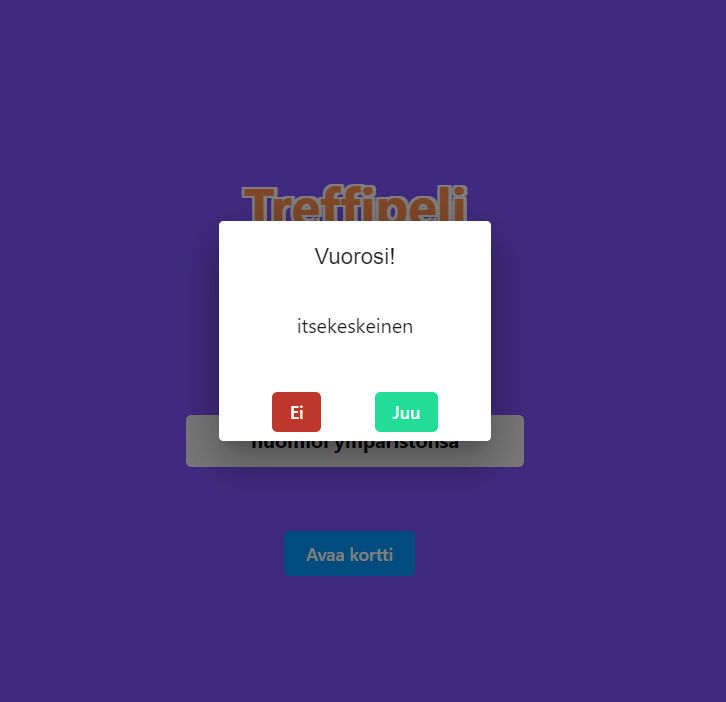

# Treffipeli

### Esittely

Treffipeli on suunniteltu tarjoamaan pelaajille viihdyttävää ja vuorovaikutteista ajanvietettä. Peli antaa mahdollisuuden käyttää mielikuvitusta ja luoda hauskoja tilanteita kuvitteellisten treffikokemusten kautta. Tavoitteena on nauttia yhdessäolosta, luoda hupaisia muistoja ja viettää rentoa aikaa ystävien seurassa. Peli yhdistää juoman nauttimisen ja pelin pelaamisen luoden hauskan ja rentouttavan ilmapiirin.

### Pelin kulku
1. Yksi pelaajista luo pelin ja toimii pelin "isäntänä". Luomisen jälkeen käyttöliittymään avautuu aula, johon muut pelaajat voivat liittyä aulan koodilla. Isäntä voi tarvittaessa poistaa pelaajia aulasta.
2. Kun aulassa on kaikki pelaajat, isäntä voi aloittaa pelin painamalla "aloita peli" napista, jolloin kaikki pelaajat siirtyvät peliin. Isännän tulee vielä painaa "Aloita jako" napista, jotta vuorot alkavat.
3. Jokaiselle pelaajalle generoidaan treffikumppani ja pelaajalle vedetään hänen vuorollansa kortti, jossa ilmenee joku ominaisuus kumppanissa. Pelaaja voi päättää jatkaako hän kumppanin kanssa seuraaville treffeille eli vuorolle. Jos pelaaja ei jatka kumppaninsa kanssa, hänelle generoidaan uusi kumppani.
4. Pelissä ei tällä hetkellä ole asetettua loppua, vaan pelaajat voivat itse päättää milloin peli loppuu.

### Juomasäännöt
1. KAIKKI pelaajat juovat "ensimmäisille treffeille" ennen kuin ensimmäinen pelaaja lukee ääneen mitä hänen kortissaan lukee.
2. Jos pelaaja päättää olla jatkamatta kumppanin kanssa, kaikki pelaajat juovat.
3. Pelin edetessä kaikki pelaajat juovat jokaisen kolmansille, viidensille ja kuudensille treffeille.

# Käyttöliittymä
- Suunnitelma, https://www.figma.com/file/w838b3bW6LBu98DKPo6hQJ/Treffipeli?type=design&node-id=2%3A2&mode=design&t=ilmjYHuqAJE0XGyR-1
- Client, <a href="https://github.com/SajariS/Juomapeli-front">https://github.com/SajariS/Juomapeli-front</a>

## Kuvia käyttöliittymästä

### Etusivu


### Peliaula isännän näkökulmasta


### Peliruutu kumppani


### Peliruutu vuoro



# Teknologiat

### Backend
- Java 17
- SpringBoot 3.2.2
- Spring Web
- Spring WebSocket
- Spring Data JPA
- Spring Security
- H2 Database
- jaxb
- jjwt
- gson

### Frontend
- React 18.2.0
- Vite 5.0.8
- stomp/stompjs 7.0.0
- sockjs-client 1.6.1
- mui/material
- mui/icons-material
- emotion/react
- emotion/styled

# Asennus

Projektin mukana tulee dockerfile tiedosto, jonka avulla palvelimen voi pystyttää helposti konttiin. Tuorein versio löytyy myös dockerhubista tägillä sajaris/juomapeliback.

Konttiasennukseen tarvitsee pelkästään Dockerin.

## Asennus komennot

### 1.a Imagen luonti
```
# docker build -f .\juomapeli.Dockerfile . -t <Imagen nimi>
```

### 1.b Imagen pull
```
# docker pull sajaris/juomapeliback:latest
```

### 2 Kontin luominen
```
# docker run -p 127.0.0.1:8080:8080 -d --rm <Imagen nimi>
```

# Linkit
- Tarinat: https://github.com/users/SajariS/projects/5/views/2
- Sprintti: https://github.com/users/SajariS/projects/6/views/1
- Lisenssi: https://github.com/SajariS/JuomaPeli/blob/main/LICENSE.md
- Loppuraportti: https://github.com/SajariS/JuomaPeli/blob/main/loppuraportti.md

# Yhteystidot

- Karl Tamme, kaarlojuuolen@hotmail.com
- Sampo Lehtonen, sampojolehtonen@gmail.com
- Sampo Westerholm, sampo.westerholm@gmail.com
- Santeri Sajari, santeri.sajari@gmail.com
